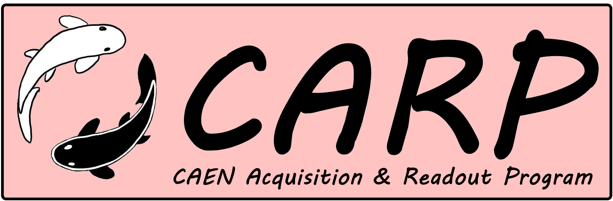

<a href="https://github.com/jwaiton/CARP">
    
</a>

#
[](https://www.python.org/downloads/release/python-3120/) [](https://github.com/jwaiton/CARP/actions) [](https://github.com/jwaiton/CARP/actions) [](https://github.com/jwaiton/CARP/actions)
### What is CARP?

**CARP** is a readout and acquisition program for CAEN digitisers (generation 1 and 2), using the [CAEN FELib](https://pypi.org/project/caen-felib/) python bindings and Qt6.

### Getting started

To initialise CARP, simply run `source setup.sh`.

CARP, like MULE uses a config based system. The configs consist of 2 components:

#### Digitiser settings
These consist of settings related to the connection type (USB, Optical, A4818), the digitiser in use (DT5730, etc).

#### Recording settings
These consist of settings related to the recording window, amount of time post trigger, etc.

#### Usage

To run CARP with a config, simply initialise CARP and run:
```carp config.conf```


